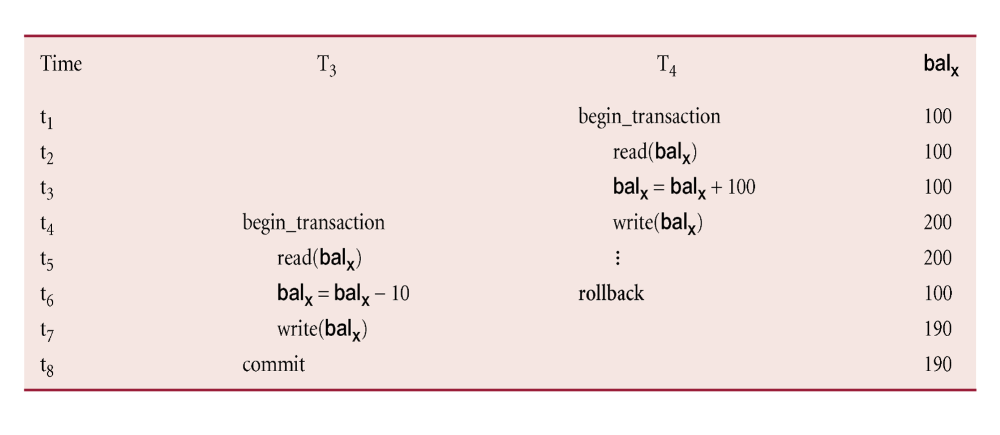

# Transactions & Concurrency

## **🎯 Learning Objectives**
- Understand the **ACID** properties of transactions.
- Identify **concurrency issues**
- Use **isolation levels** to manage concurrency.
- Implement **transaction management** in application code. 
- Handle **deadlocks** and implement proper **locking mechanisms**.

---

# **1️⃣Transactions**

To implement a large-scale, busy, or highly reliable database application, it is important to understand transactions and locking. 

**Definition**: A transaction is an action, or series of actions, carried out by a single user or application as a unit of work. Transactions read or update the contents of a database.  A transaction is needed when more than one user wants to access the same data.
A transaction can use locks to isolate it from other concurrently executing transactions.

A transaction must have the following **ACID Properties:**
  - **Atomicity**: All or nothing.
  - **Consistency**: Database remains consistent both before and after the transaction.
  - **Isolation**: Transactions do not interfere.
  - **Durability**: Changes persist after commit.

A transaction has states and can have one of two outcomes. If it completes successfully, the transaction is said to have **committed** and the database reaches a new consistent state. If the transaction does not end successfully, the transaction is **aborted** and the database must be restored to the consistent state before the transaction started. Such a transaction is **rolled back**.


 We have two main issues to deal with regarding transactions:
 - Failures of various kinds, such as hardware failures and system crashes during a transaction.
 - Concurrent execution of multiple transactions.

We will cover concurrency issues in the next section.

---
# **2️⃣The Need for Concurrency Control**

**Isolation** determines transaction visibility between processes. A transaction should take place in such a way that it is the only transaction that is accessing some data item.

Isolation levels define the degree to which a transaction is isolated from data modifications made by any other transaction. A transaction isolation level is defined by the following phenomena: 
| Issue | Description |
|-------|------------|
| **Lost Update** | Two transactions overwrite each other's changes. |
| **Dirty read** | A transaction reads uncommitted changes from another transaction. |
| **Non-repeatable Read** | A transaction reads the same row twice and gets a different value each time |
| **Phantom Read** | A transaction sees new rows when repeating a query, due to inserts by another transaction. |

Let's look at some examples of concurrency problems.

### **Lost Update Problem**
Successfully completed update is overridden by another user.

- T1 withdrawing £10 from an account with balx, initially £100.
- T2 depositing £100 into same account. 
- Serially, final balance would be £190.
- Loss of T2’s update can be avoided by preventing T1 from reading balx until after update.


### **Uncommitted Dependency Problem**
Occurs when one transaction can see intermediate results of another transaction before it has committed.
- T4 updates balx to £200 but it aborts, so balx should be back at original value of £100.
- T3 has read new value of balx (£200) and uses value as basis of £10 reduction, giving a new balance of £190, instead of £90.
- Problem can be avoided by preventing T3 from reading balx until after T4 commits or aborts.
  


### **Inconsistent Analysis Problem**
Occurs when a transaction reads several values from the database but a second transaction updates some of them during the execution of the first.

- T6 is totaling balances of account x (£100), account y (£50), and account z (£25).
- Meantime, T5 has transferred £10 from balx to balz, so T6 now has wrong result (£10 too high).
- Problem can be avoided by preventing T6 from reading balx and balz until after T5 completed updates.


---
# **3️⃣ Transaction Model**

Database systems have their own infrastructure components to support transactions and concurrency:


- The **Transaction manager** coordinates transactions on behalf of the application programs.
- It communicates with the **scheduler** which is responsible for implementing a strategy for concurrency control.
- The scheduler is sometimes referred to as the **lock manager** if the concurrency control protocol is lock-based. 
- The objective of the scheduler is to maximize concurrency without allowing concurrently executing transactions to interfere with one another, and in that way compromise the integrity or consistency of the database.

The objective of a concurrency control protocol is to schedule transactions in such a way as to avoid any interference. We could run transactions serially, but this limits the degree of concurrency and parallelism in the system. 

**Serializability** ensures correct exeution order. Meaning that the **final result of executing multiple concurrent transactions is the same as if they were executed in some serial order**.
This is the **strongest level of isolation**, but full serializability is expensive and can reduce parallel execution. <br>

**Isolation Levels:**
The SQL standard describes four transaction isolation levels. Each of the transaction isolation levels uses different strategies to balance consistency and concurrency on the database.

**REPEATABLE READ isolation level** is default for MySQL and MariaDB whereas **READ COMMITTED** isolation level is the default for SQL Server, PostgreSQL and Oracle.

So this is default for MySQL:

| Isolation Level | Prevents Dirty Reads | Prevents Non-repeatable Reads | Prevents Phantom Reads |
|---------------|-------------------|-----------------------|------------------|
| **READ UNCOMMITTED** | ❌ No | ❌ No | ❌ No |
| **READ COMMITTED** | ✅ Yes | ❌ No | ❌ No |
| **REPEATABLE READ** (MySQL default) | ✅ Yes | ✅ Yes | ❌ No |
| **SERIALIZABLE** | ✅ Yes | ✅ Yes | ✅ Yes |

There are different **Concurrency Control Techniques** to achieve serializability and isolation:
- **Two-Phase Locking (2PL)** – Transactions acquire all locks before releasing any. The data item to be accessed is locked by the first transaction. After performing operations transaction unlocks the data item, so that it can be accessed by other transactions. 
- **Timestamp Ordering** – Transactions execute based on timestamps.This protocol ensures that every conflicting read and write operations are executed in timestamp order
- **Validation-Based Concurrency Control** – Transactions validate before committing.<br>

Timestamping and locking are conservative (pessimistic) approaches: delay transactions in case they conflict with other transactions.
Validation based control is an optimistic method assuming conflict is rare and only check for conflicts at commit.

In MySQL [InnoDB](https://dev.mysql.com/doc/refman/8.4/en/innodb-introduction.html) is the default storage engine and it offers all four transaction isolation levels. It's [transaction model](https://dev.mysql.com/doc/refman/8.4/en/innodb-transaction-model.html) aims to combine the best properties of a multi-versioning database with traditional two-phase locking [source](https://dev.mysql.com/doc/refman/8.4/en/glossary.html#glos_mvcc).


**MySQL Example to Set Isolation Level:**
```sql
SET TRANSACTION ISOLATION LEVEL REPEATABLE READ;
START TRANSACTION;
-- SQL Statements
COMMIT;
```
---
# 4️⃣ **Locking**🔒
Locks are the most widely used approach for transactions to ensure serializability, i.e. to deny access to other transactions and so prevent incorrect updates.

Generally, a transaction must claim a **shared** (read) or **exclusive** (write) lock on a data item before read or write. In case of a write lock, it prevents other transactions from modifying the item or even reading it. 

**Locking Basic Rules**
- If transaction has shared(s) lock on item, it can only read, not update item.
- If transaction has exclusive(x) lock on item, it can both read, update or delete item.
- Reads cannot conflict, so more than one transaction can hold shared locks simultaneously on same item. 
- An exclusive lock gives transaction exclusive access to that item.- 
- Lock requests are made to concurrency control manager. Transaction can proceed only after request is granted.

There are **row locks**, **table locks** and **range locks**. An examle of a range lock: all employees that have a salary between 50.000-100.000.

Row-level locking can lock the entire table, if the WHERE clause of a statement cannot use an index - for instance an UPDATE statement.  
If a high number of single-row locks would be less efficient than a single table-level lock, the row-level locking system can choose table-level locking instead for performance reasons (called lock escalation).

Some systems allow transaction to upgrade read lock to an exclusive lock, or downgrade exclusive lock to a shared lock.

---
# 5️⃣ **MySQL Examples**

## 📌Consistent Reads

- We want rereads of a data item to remain consistent during the entire transaction.
- In a transaction, all **regular SELECT queries** read from a **consistent snapshot** taken by the first query.
- This snapshot includes changes from **committed transactions before that point** but ignores **uncommitted or later transactions** (using InnoDB's [multi version concurrency control](https://dev.mysql.com/doc/refman/8.4/en/glossary.html#glos_mvcc) which is not universal database technique).
- To **refresh the snapshot**, **commit** the transaction and start a new query.


```sql
START TRANSACTION;
SELECT * FROM Players WHERE player_id = 1; -- Reads from snapshot
UPDATE Players SET rank = rank + 10 WHERE player_id = 1;
SELECT * FROM Players WHERE player_id = 1; -- Another transaction/session will still sees old value in snapshot
COMMIT;
```

💡 **The second SELECT does not see the update** (if the query is made by another transation). 

---

## Test  in MySQL Workbench. [Go to Exercise](exercise1.md)
--- 

## 📌 Committed Reads
- We want to modify data and we want to work on most updated (committed) data.
- If you **query data and then modify it** within the same transaction, other transactions **can still change or delete** the same rows unless you lock the data.
- To avoid inconsistencies, use ```FOR UPDATE``` to ensure you work with the latest committed values.

```sql
START TRANSACTION;
SELECT * FROM Players WHERE player_id = 1 FOR UPDATE;
-- This forces MySQL to fetch the latest committed value
```
✅ FOR UPDATE ensures that you see the most recent committed value and locks the row from modifications by others. 


## 📌 Shared Lock

- We want to place a **shared lock** on selected rows while we read data so other transactions **can read but not modify** these rows until our transaction commits.
- In other words, we don't want to see uncommited work (avoid dirty reads) or rows changed by another transaction (avoid non-repeatable reads).
- If another transaction is already modifying the row, your query **waits** until that transaction finishes.

#### **Transaction 1 (Locks Row)**
```sql
START TRANSACTION;
SELECT * FROM Players WHERE player_id = 1 FOR SHARE;
-- Transaction is holding a shared lock
```
#### **Transaction 2 (Blocked Update)**
```sql
START TRANSACTION;
UPDATE Players SET ranking = ranking + 20 WHERE player_id = 1;
-- 🚨 This query will wait until Transaction 1 commits or rolls back
```

✅ **Use case:** Ensuring no one modifies a row while you are reading it.


## 📌 Exclusive Lock

- We want to place a **exclusive lock** on selected rows because we want to modify data/table and prevent modifications by other transactions.
- Using `SELECT ... FOR UPDATE` (Exclusive Lock) locks the selected rows **as if an UPDATE statement was issued**.
- Blocks **other transactions from modifying, deleting, or even locking** the same rows.
- Ignores locks on old versions of records (undo logs reconstruct these instead).

#### **Transaction 1 (Locks Row for Update)**
```sql
START TRANSACTION;
SELECT * FROM Players WHERE player_id = 1 FOR UPDATE;
-- Other transactions cannot modify or lock this row until commit
```
#### **Transaction 2 (Blocked Update & FOR SHARE Lock)**
```sql
START TRANSACTION;
UPDATE Players SET ranking = ranking + 30 WHERE player_id = 1; -- 🚨 Blocked
SELECT * FROM Players WHERE player_id = 1 FOR SHARE; -- 🚨 Blocked
```
✅ **Use case:** When you plan to update the selected rows and want to prevent conflicts.

## **📌 Lock a range**

#### **Transaction 1 (Locks a Range of Players)**
```sql
START TRANSACTION;
SELECT * FROM Players WHERE ranking BETWEEN 1000 AND 1500 FOR UPDATE;
```
#### **Transaction 2 (Blocked Insert)**
```sql
START TRANSACTION;
INSERT INTO Players (player_id, username, ranking) VALUES (6, 'NewPlayer', 1200);
-- 🚨 Blocked because Transaction 1 locked this range
```
✅ **Use case:** Ensuring no new data is inserted into a range while a transaction is in progress.

## **📌 How Locks Are Released**
- Locks from `FOR SHARE` and `FOR UPDATE` are released when the transaction commits or rolls back.
- Locking depends on the **search condition and index type**:
  - **Unique index with a unique search condition:** Locks **only the matched row**.
  - **Range searches or non-unique conditions:** Locks the **entire scanned range**, preventing other transactions from inserting new rows into the range.

## **📌 Summary**
| **Locking Read** | **Effect** | **Use Case** |
|-----------------|-----------|--------------|
| `FOR SHARE` | Prevents modification but allows reading | Ensuring a row isn’t changed while reading it |
| `FOR UPDATE` | Prevents other transactions from modifying or locking the row | Preparing a row for an update without interference |

💡 **Locks are released on COMMIT or ROLLBACK.**

---
# 6️⃣ **Managing Transactions in Java**

**Using JDBC:**
```java
Connection conn = DriverManager.getConnection(url, user, password);
conn.setAutoCommit(false);
try (PreparedStatement stmt = conn.prepareStatement("UPDATE Players SET rank = rank + 10 WHERE player_id = ?")) {
    stmt.setInt(1, 1);
    stmt.executeUpdate();
    conn.commit(); // Commit transaction
} catch (SQLException e) {
    conn.rollback(); // Rollback if error
}
```

**Using JPA (`@Transactional`)**:
```java
@Transactional
public void updatePlayerRank(int playerId) {
    Player player = entityManager.find(Player.class, playerId);
    player.setRank(player.getRank() + 10);
}
```

### **🔹 Handling Deadlocks**
- **Use proper locking:** `SELECT ... FOR UPDATE`.
- **Retry transactions if needed:** Catch `SQLState 40001` and retry.

---

# **7️⃣ Deadlocks**
A deadlock occurs when two or more transactions block each other by holding locks on resources that the other transactions need. As a result, neither transaction can proceed, and the database must detect and resolve the deadlock.
[Go to deadlock notes and exercises](deadlocks.md).
---

🎯 **Great you reached the end! Hopefully you have practised transaction management doing the exercise work 🚀**
